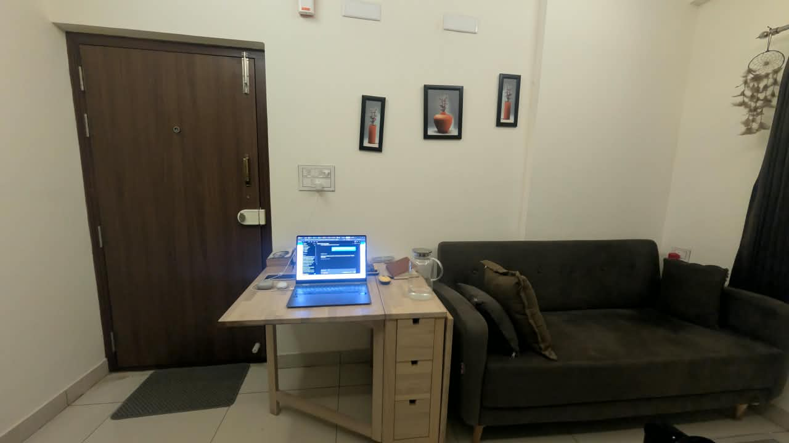
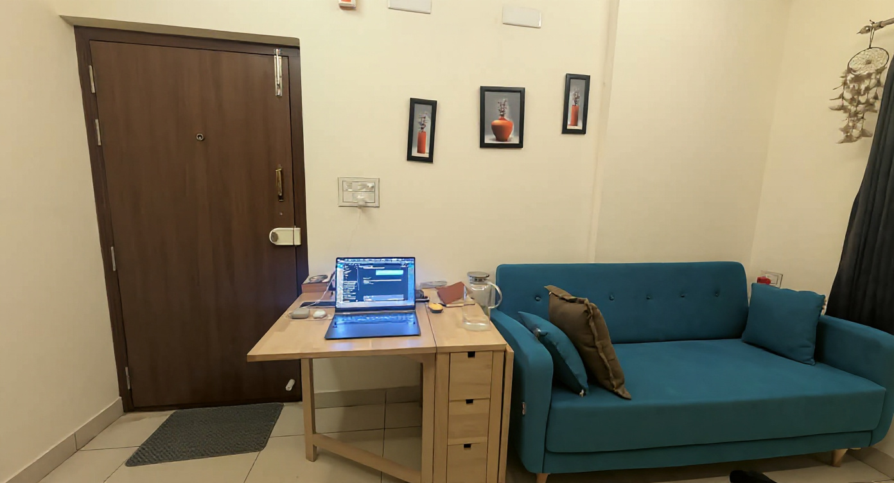
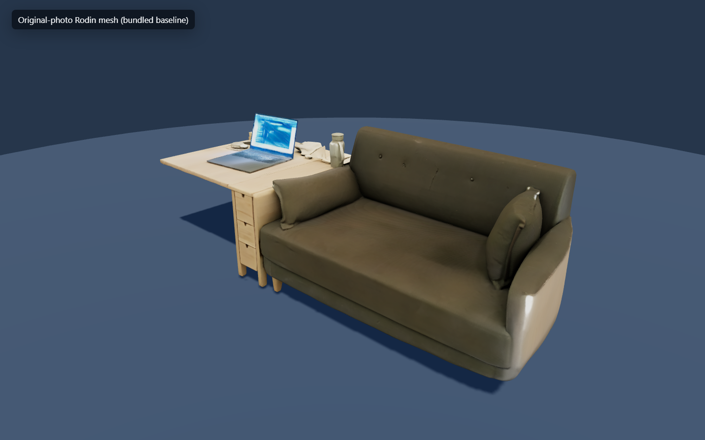
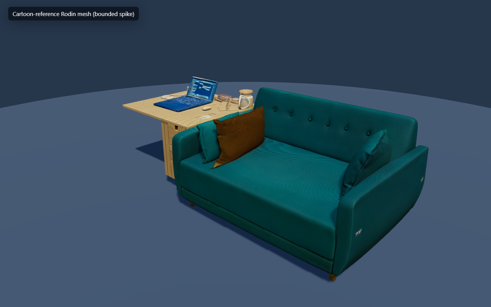

# Style-to-mesh spike and production decision

Date: 2026-09-24  
Owner: Worker 3 — visual styles and 3D feasibility

## Decision

ObjectQuest will keep geometry generated from the user's original photo set and
apply Cartoon, Hand-painted, or Watercolor coherently in the engine through
materials, lighting, lightweight shaders, environment dressing, and gameplay
marker styling.

The approved style preview remains a **visual direction**, not a texture promise
or a guarantee that the mesh will reproduce every brush stroke. It should not be
submitted to the production 3D path by default.

The styled-reference path did produce a recognizable sofa-and-desk asset and
retained the preview's teal palette, so it is technically feasible for an
explicit future experimental mode. It did not retain a clear cartoon treatment,
cost an additional image edit, produced ten times as many triangles, increased
the GLB size almost fivefold, and did not improve automatic course usability.

## Bounded experiment

The input was the clearest bundled front view,
[`public/samples/photo-4.jpg`](../public/samples/photo-4.jpg), showing the sofa,
desk, and laptop arrangement represented by the existing Rodin sample. One
Kontext edit created a cartoon direction image; exactly one Rodin call consumed
that image. The committed runner uses deterministic, per-step idempotency keys,
persists the upload URL before dispatch, refreshes health and price immediately
before each paid call, rejects fallbacks, and never retries a paid call
automatically.

The edit preserved composition and recognizable furniture, but most of the image
remained photographic. Its strongest visible change was the sofa's teal palette;
the requested simplified cel-shading and contour treatment was weak.

### Live jobs and cost

| Step | Requested/actual capability | Job | Health gate | Reported cost | Result |
| --- | --- | --- | --- | --- | --- |
| Styled reference | `kontext-edit` / `kontext-edit` | `mjob_7c10fc5aa558` | `ok`, available/active | $0.042 estimated, disposition `spent`; provider-metered value absent | Done in 7.441 s; no fallback |
| Styled mesh | `rodin-i3d` / `rodin-i3d` | `mjob_03a06e271b73` | `unknown`, available/active (not degraded) | $0.420 estimated, disposition `spent`; provider-metered value absent | Done in 128.411 s; no fallback |

The keyless demo ledger recorded **$0.462 spent** against the $1.50 spike cap.
Both terminal responses left `cost_paid_usd` null, so upstream provider-metered
cost is unknown, not zero. A session cost-report read later timed out; the two
terminal job records are the cost evidence. Full redacted provenance is in
[`style-spike-provenance.json`](evidence/style-spike-provenance.json).

No other paid capability was called.

## Mesh comparison

Both GLBs were rendered with the same evidence viewer, camera, lighting, and
tone mapping. The screenshots are diagnostic renders, not the production style
renderer.

| Criterion | Original-photo bundled Rodin mesh | Cartoon-reference Rodin mesh | Finding |
| --- | --- | --- | --- |
| Recognizability | Sofa, desk, laptop, cushions, and desktop objects are clear. | The same core arrangement is clear; several small object shapes differ. | Both recognizable. The styled path passes this one-object spike, not arbitrary objects. |
| Style retention | Neutral photographic PBR appearance. | Teal palette retained strongly, but fabric, wood, laptop, and lighting remain largely photographic; no reliable outline or cel simplification. | Palette transfer succeeded; coherent Cartoon style did not. |
| Topology | 50,000 triangles, 0 degenerate; 4,979,900 bytes. | 500,000 triangles, 0 degenerate; 24,302,428 bytes. | 10× triangles and 4.88× file size for the styled path. |
| Normalization | Y-up confidence 1.83; 8 m normalized footprint; 2.545 m high. | Y-up confidence 1.97; 8 m normalized footprint; 2.574 m high. | Existing normalization handles both without overrides. |
| Collision sampling | 562 standable patches; 949 sampled patches. | 620 standable patches; 1,086 sampled patches. | Both yield usable triangle collision; styled analysis is materially heavier. |
| Preparation timing on this machine | Surface sampling 64 ms; course plan 71 ms. | Surface sampling 242 ms; course plan 268 ms. | The styled mesh took about 3.8× as long across these two CPU stages. Single runs are indicative, not a benchmark distribution. |
| Generic course | Validated five-checkpoint ground route; no reachable elevated checkpoint and no helper proposal. | Validated five-checkpoint ground route; a low 0.4 m tier is reachable, but no 1.4/2.3 m furniture tier or helper proposal is used. | Neither automatic course is suitable for the climbing fantasy without editor/helper work. |
| Authored course evidence | The bundled manifest has a measured helper staircase and an authored route onto the 1.286 m desk. | No authored route; generated course remains ground-biased. | Styled geometry does not preserve the known baseline course and would require fresh authoring/validation. |

The styled GLB is intentionally not committed. It is 24,302,428 bytes at
`scripts/spike/output/photo-4-cartoon-rodin.glb`, SHA-256
`b397d4d78fc1709ef0aeca77af9a174b41158e3d092812e4c628b9bbe577167e6`.

## Production approach

The production pipeline therefore uses:

1. Original-photo geometry, including the strongest available multi-view input.
2. One shared style definition that supplies image prompts, scene colors,
   lighting, render parameters, environment dressing, audio prompts, and
   interface accents.
3. Engine-side material treatment and lighting for the generated mesh, plus
   readable high-contrast materials for game-added floors, ramps, checkpoints,
   fragments, and portals.
4. Lightweight surrounding scenery that never pretends to be reconstructed
   object geometry and does not silently alter collision.
5. A `colorRestoration` value from 0 through 1 that drives saturation/color
   recovery without rebuilding geometry or materials.

This path preserves one collision mesh and one validated course while styles
change. It is deterministic after asset load, incurs no extra 3D generation per
style, and lets reduced-motion and device-performance choices be handled at
render time.

## Limitations and guardrails

- This is a one-scene spike. The styled mesh used one input photo while the
  bundled Rodin baseline used five (`4, 1, 2, 3, 5`), so photo-count and source
  changes are a comparison confound. The result is enough to reject styled mesh
  generation as the default, not to claim it never works.
- A generated preview is not a UV texture. Its pixels cannot be projected onto
  an independently generated GLB without camera calibration, UV correspondence,
  and occlusion handling that this pipeline does not provide.
- Independently styled multi-view images are not assumed geometrically
  consistent. The spike deliberately did not spend on extra edits to manufacture
  unsupported consistency evidence.
- Engine-side styles coordinate palette, value grouping, lighting, and
  atmosphere; they cannot guarantee exact reproduction of preview brush strokes
  on arbitrary provider materials.
- Outline and wash effects must remain readable during jumping. The initial
  implementation uses material/lightweight shader techniques and avoids a new
  post-processing dependency.
- Generated scenery is decorative unless explicitly authored into the manifest
  and revalidated. A generated image or video is never treated as collision or a
  navigable environment.
- Both generic course plans were ground-biased. A visually good asset must still
  pass course validation and may require the existing editor/helper path before
  publication.
